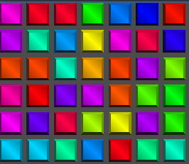

# Tile Factory

Colored square tile generator code.

This implements the Factory Pattern where you may configure the `tile_factory.tscn` file as an Auto load.

The function `get_tile` returns a sprite using the color that is input to it.

Running the scene stand-alone produces this test pattern:

